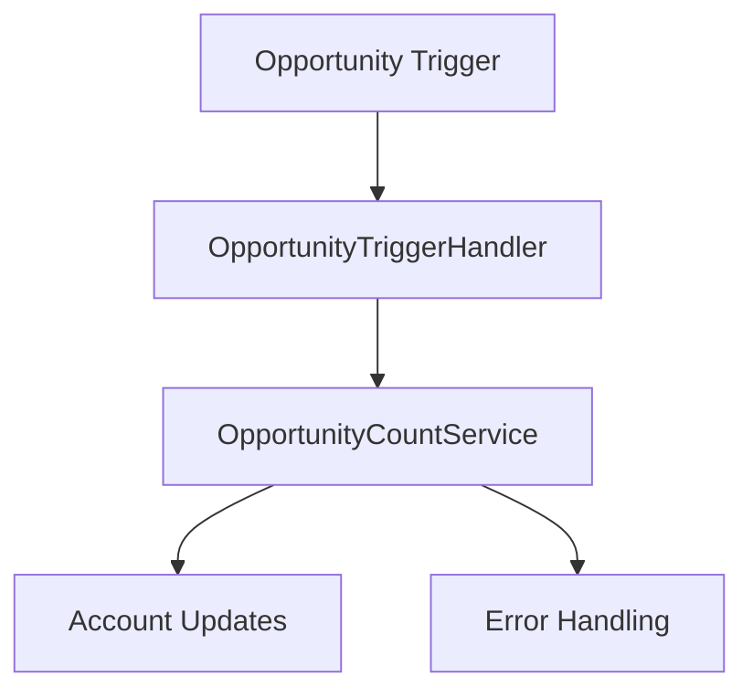

# Design Document

## Overview

The Opportunity Counter System will be redesigned to follow Salesforce best practices with proper separation of concerns, bulk processing capabilities, and robust error handling. The system will use a trigger handler pattern to manage opportunity lifecycle events and maintain accurate counts on Account records.

## Architecture

The solution follows a layered architecture:

1. **Trigger Layer**: Lightweight trigger that delegates to handler
2. **Handler Layer**: Manages trigger context and orchestrates business logic
3. **Service Layer**: Contains core business logic for counting operations
4. **Utility Layer**: Helper methods for data operations and calculations



## Components and Interfaces

### OpportunityTriggerHandler
- **Purpose**: Central handler for all opportunity trigger events
- **Responsibilities**:
  - Determine trigger context (insert, update, delete, undelete)
  - Collect affected Account IDs
  - Delegate to service layer for processing
  - Handle bulk operations efficiently

### OpportunityCountService
- **Purpose**: Core business logic for opportunity counting
- **Responsibilities**:
  - Calculate count changes per Account
  - Query current Account data
  - Prepare bulk updates
  - Handle edge cases (null AccountIds, account changes)

### Key Methods:
```apex
public class OpportunityTriggerHandler {
    public static void handleAfterInsert(List<Opportunity> newOpps)
    public static void handleAfterUpdate(List<Opportunity> newOpps, List<Opportunity> oldOpps)
    public static void handleAfterDelete(List<Opportunity> oldOpps)
    public static void handleAfterUndelete(List<Opportunity> newOpps)
}

public class OpportunityCountService {
    public static void updateAccountCounts(Map<Id, Integer> accountCountChanges)
    private static Map<Id, Integer> calculateCountChanges(List<Opportunity> opportunities, Integer multiplier)
}
```

## Data Models

### Account Fields
- **Total_Opportunities__c**: Number field to store opportunity count
- **Type**: Number(18,0)
- **Default Value**: 0

### Opportunity Fields
- **AccountId**: Standard lookup to Account
- Used for determining which Account to update

## Error Handling

### Exception Management
1. **DML Exceptions**: Catch and log DML failures without stopping entire transaction
2. **Null Pointer Exceptions**: Validate data before processing
3. **Governor Limit Protection**: Use bulk patterns and limit SOQL queries

### Logging Strategy
- Log errors to System.debug for development
- Consider custom logging object for production monitoring
- Include context information (record IDs, operation type)

### Recovery Mechanisms
- Use Database.update with allOrNone=false for partial success scenarios
- Implement retry logic for transient failures
- Maintain data consistency through proper transaction boundaries

## Testing Strategy

### Unit Tests
1. **Trigger Handler Tests**:
   - Test each trigger event type (insert, update, delete, undelete)
   - Verify correct delegation to service layer
   - Test bulk operations (200+ records)

2. **Service Layer Tests**:
   - Test count calculation logic
   - Test Account update operations
   - Test error handling scenarios

3. **Integration Tests**:
   - End-to-end trigger execution
   - Mixed operation scenarios
   - Data integrity validation

### Test Data Strategy
- Use Test.startTest()/Test.stopTest() for governor limit testing
- Create test accounts and opportunities in bulk
- Test edge cases (null AccountIds, account changes)

### Coverage Requirements
- Minimum 75% code coverage
- Focus on business logic paths
- Include negative test cases

## Performance Considerations

### Bulkification
- Process all records in collections, not individual loops
- Single SOQL query to get Account data
- Single DML operation to update Accounts

### Governor Limits
- Limit SOQL queries (max 100 per transaction)
- Limit DML statements (max 150 per transaction)
- Monitor heap size for large data sets

### Optimization Strategies
- Use Map<Id, Integer> for efficient count aggregation
- Minimize database round trips
- Cache Account data when possible

## Migration Strategy

### Current Code Issues
1. Static variables cause cross-transaction contamination
2. Individual record processing instead of bulk
3. Missing error handling
4. Incomplete trigger event coverage

### Migration Steps
1. Create new handler and service classes
2. Update trigger to use new handler
3. Deploy and test in sandbox
4. Remove old CountOpportunities class after validation